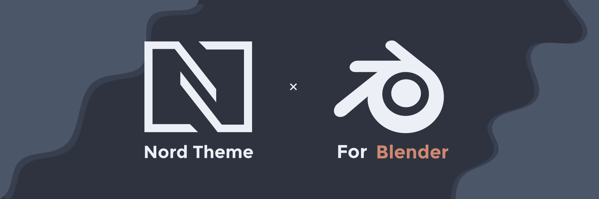
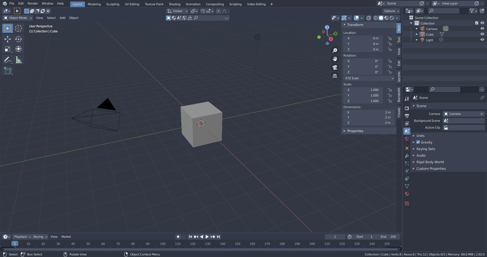
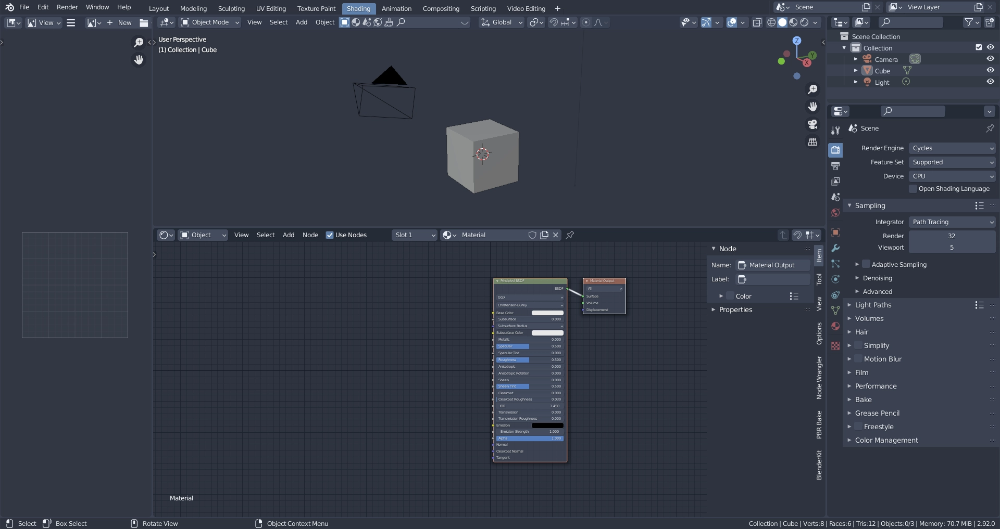
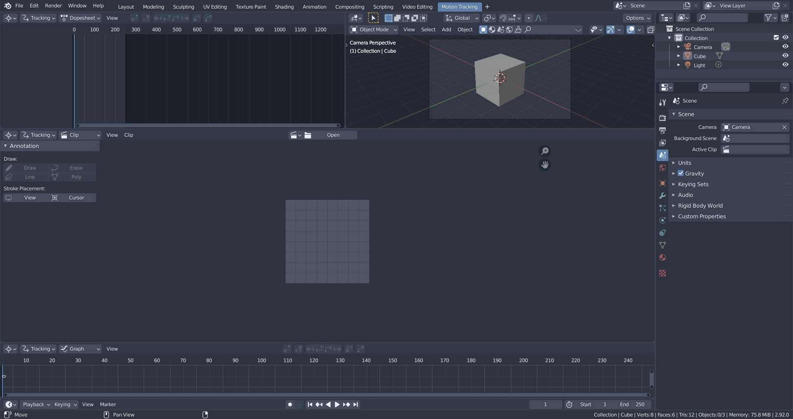
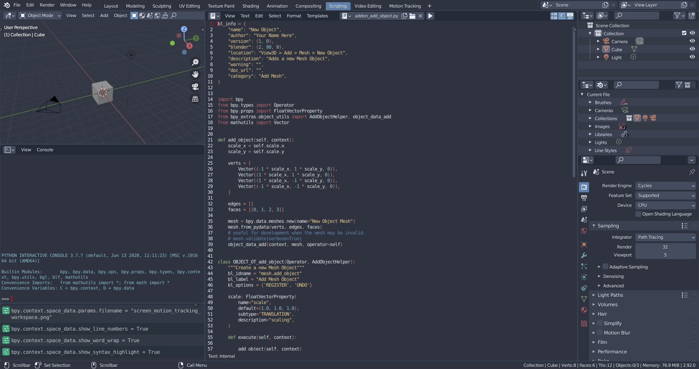

# Nord Dark Theme for Blender

A dark theme for Blender 2.8x+ utilizing the [Nord Color Pallette](https://www.nordtheme.com/) by [Arctic Ice Studio](https://github.com/arcticicestudio)

# All workspaces in Blender are themed, here are some examples

## Main Workspace, 3D Viewport

## Shading Workspace

## Motion Tracking Workspace

## Scripting Workspace

With Syntax Highlighting

# How do I put this thing in the other thing???

### or how to install

___

1. Download [this repo as zip](https://github.com/TehMerow/blender_nord_dark_theme/archive/refs/heads/main.zip) or clone the repository then extract to somewhere on your device

2. Open Blender and go to the theme preferences under Edit > Prefrences > Themes

3. Click on the install button and navigate to where you extracted the zip file or cloned the repository, click on "nord_dark.xml" and click on "Install Theme"

4. Select the theme from the theme dropdown menu

5. You're done! 🥳

Have fun and if you enjoy this theme ~~~ 

